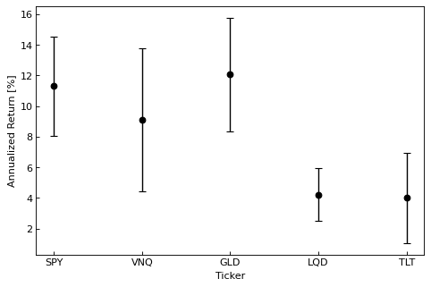
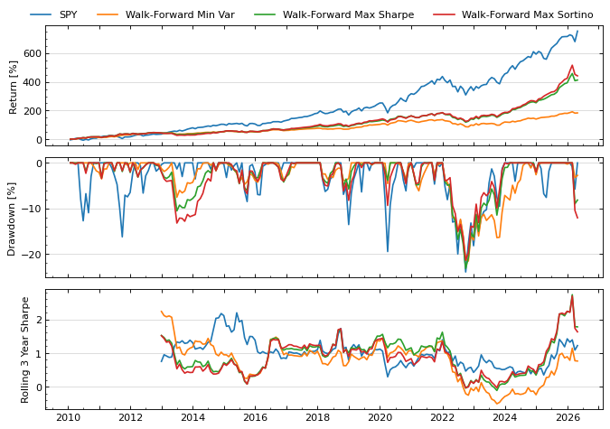
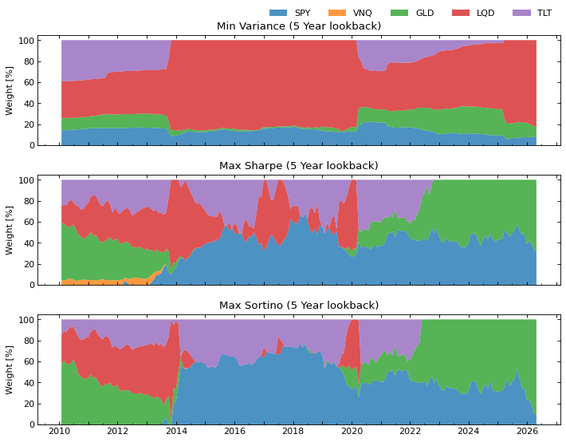
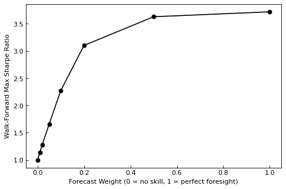
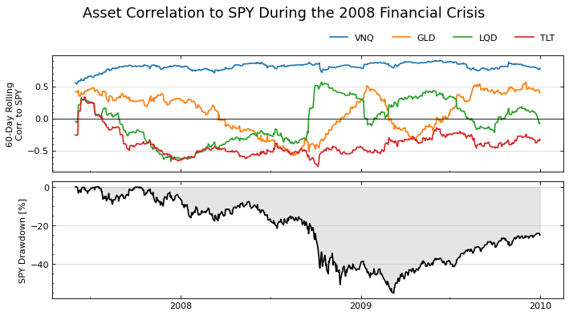

# Portfolio Optimization

Can textbook mean-variance optimization (MVO) beat a simple buy-and-hold S&P 500 position for a retail investor? Here I explore building a long-only portfolio from a handful of asset-class ETFs and apply the optimization strategy in a walk-forward backtest.

**Universe:** SPY (US large cap), VNQ (REITs), GLD (gold), LQD (investment-grade bonds), TLT (long-term Treasuries)

**Data:** ~20 years of daily and monthly returns (2005–2026). ETF prices from yfinance, risk-free rate from the Kenneth French Data Library.

## Findings

**1. Diversify via mean-variance optimization**

Combining assets with different risk/return profiles can result in a portfolio with theoretically higher return for a given risk level than the individual assets. I used MVO to solve for the Global Minimum Variance, Maximum Sharpe, and Maximum Sortino portfolios. Returns are estimated from monthly data whereas covarainces are calculated from daily data to improve estimates.

**2. The inputs are noisy**

MVO is only as good as its inputs. Over 20 years, the standard error on the mean expected return on each asset is comparable to the differences between assets. Hence, the optimizer is largely reacting to estimation noise, not real signal.

**3. In-sample results are smoother but not realistically achievable**

Built on the full history, the optimized portfolios roughly halve SPY's drawdown (−50% to ~−20%) but those weights were chosen using future data, so this isn't realizable.

**4. Walk-forward backtest shows what could really be achievable**

I estimate how an average retail investor could use MVO by rebalancing every month on a trailing 5-year window. SPY still outperforms the optimized portfolios on raw return. However, the 2008 drawdown is not included in this sample due to the 5-year lookback so it may be a bit skewed.

**5. MVO performance improves significantly with forecast**

I blend a controllable amount of perfect foresight return into the expected return estimate. Even leaking 1–2% of next-month's actual return lifts the backtested Sharpe dramatically. This illustrates how valuable a good forecast is and also how much lookahead bias can skew backtest results.

**6. Diversification fails when you need it most**

MVO assumes a stable covariance matrix. But in the 2008 crisis, the correlations of "diversified" assets to SPY jumped toward 0.5 exactly when the hedge was supposed to help. This demonstrates that even though assets may have historically low baseline correlations, in times of crisis this type of diversification may not help as much as one would hope.

## Key Takeaways

- Expected return estimates limit the performance of MVO because of their noise
- Reducing volatility and drawdown is achievable out-of-sample but beating an index is much more difficult without real forecasting
- Correlations are regime-dependent, so the diversification MVO relies on can collapse during crises

## Notebooks

- **`pull-data.ipynb`**: downloads ETF prices from `yfinance` and the risk-free rate from the Kenneth French Data Library; saves to `data/`
- **`mean-variance.ipynb`**: working through an example of applying mean-variance optimization for a retail investor
